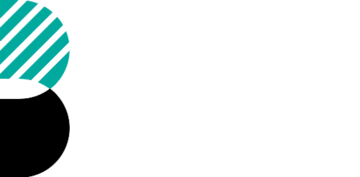
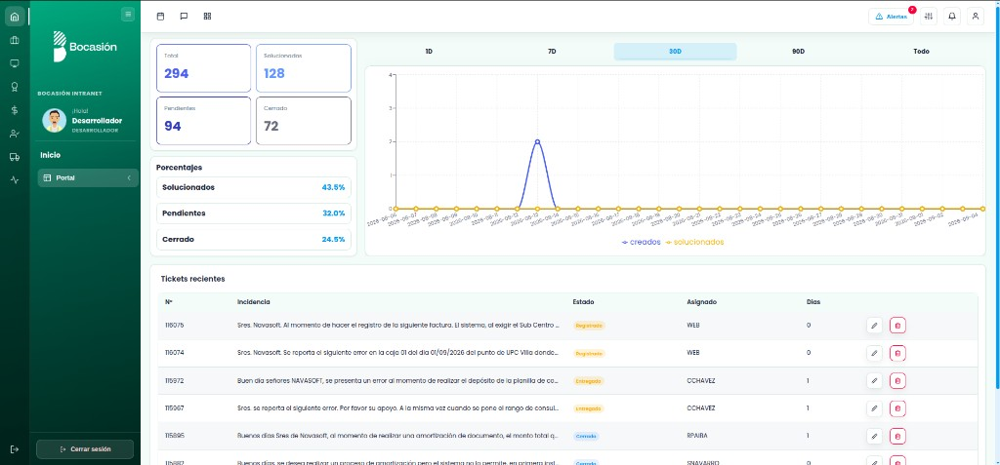

<a id="readme-top"></a>
<!-- SHIELDS -->

<p align='center'> 
  &nbsp;
  &nbsp;
  &nbsp;
  &nbsp;
</p>

<!-- PROJECT LOGO -->
<br>
<div align="center">
   
   <h3 align="center">BOCASIÓN — Intranet Dashboard</h3>
   <p align="center">
     Panel web interno de tickets, analíticas, RRHH y operaciones
     <br>
     <a href="https://github.com/hexed-AAL1X/Bocasion-Intranet"><strong>Explorar la documentación »</strong></a>
     <br>
     <br>
     <a href="https://www.bocasion.com/out/">Ver demo</a>
     ·
     <a href="https://github.com/hexed-AAL1X/Bocasion-Intranet/issues/new?labels=bug&template=bug-report---.md">Reportar un bug</a>
     ·
     <a href="https://github.com/hexed-AAL1X/Bocasion-Intranet/issues/new?labels=enhancement&template=feature-request---.md">Pedir una mejora</a>
   </p>
</div>

<!-- TABLE OF CONTENTS -->
<details>
  <summary>Tabla de contenidos</summary>
  <ol>
    <li>
      <a href="#sobre-el-proyecto">Sobre el proyecto</a>
      <ul>
        <li>
          <a href="#construido-con">Construido con</a>
        </li>
      </ul>
    </li>
    <li><a href="#avisos-importantes">Avisos importantes</a></li>
    <li>
      <a href="#primeros-pasos">Primeros pasos</a>
      <ul>
        <li><a href="#requisitos">Requisitos</a></li>
        <li><a href="#instalacion">Instalación</a></li>
      </ul>
    </li>
    <li><a href="#contribuir">Contribuir</a></li>
    <li><a href="#contacto">Contacto</a></li>
  </ol>
</details>
<br>

<!-- ABOUT THE PROJECT -->
<a id="sobre-el-proyecto"></a>***Sobre el proyecto***


<div align="center">
  
</div>

**Bocasión Intranet** es un dashboard en Next.js para operaciones internas: tickets, analíticas, equipos, programa anual, vistas de Notion, RRHH y más — pensado para mantener a los equipos alineados con datos reales.

Por qué existe:

* Centraliza tickets, alertas, analíticas y flujos de RRHH en un solo lugar.
* Builds estáticos exportables (`/out`) listos para producción.
* Manual con capturas reales del entorno en vivo.

El proyecto sigue evolucionando: espera mejoras continuas de UX y rendimiento.

<a id="construido-con"></a>
### Construido con
* &nbsp;
* &nbsp;
* &nbsp;
* &nbsp;
<p align="right">(<a href="#readme-top">volver arriba</a>)</p>

<!-- IMPORTANT NOTICES -->
<a id="avisos-importantes"></a>***Avisos importantes***


> [!NOTE]  
> Para instalar y ejecutar este dashboard, asegúrate de contar con lo siguiente:
>
> | Requisito          | Descripción                                                                                       |
> |--------------------|---------------------------------------------------------------------------------------------------|
> | Runtime            |  |
> | Gestor de paquetes |  |
> | Lenguaje           |  |

> [!IMPORTANT]\
> Nunca subas secretos al repositorio. Los archivos `.env*` y `node_modules` están ignorados por `.gitignore`. Usa variables de entorno solo en tu máquina o como secretos de CI.
<p align="right">(<a href="#readme-top">volver arriba</a>)</p>

<!-- GETTING STARTED -->
<a id="primeros-pasos"></a>***Primeros pasos***

Estas son las instrucciones para configurar el proyecto en local. Sigue estos pasos para tener una copia funcionando.

<a id="requisitos"></a>
### Requisitos
* Node.js (se recomienda LTS)
* npm
* Git

<a id="instalacion"></a>
### Instalación
_Ejemplo de cómo instalar y ejecutar el dashboard en tu máquina._

1. Clona el repositorio
   ```sh
   git clone https://github.com/hexed-AAL1X/Bocasion-Intranet.git
   ```
2. Entra al directorio del proyecto
   ```sh
   cd Bocasion-Intranet
   ```
3. Instala las dependencias
   ```sh
   npm install
   ```
4. Arranca el servidor de desarrollo
   ```sh
   npm run dev
   ```
5. Abre [http://localhost:3000](http://localhost:3000) en el navegador

6. (Opcional) Cambia la URL del remoto de Git para evitar pushes accidentales al proyecto base
   ```sh
   git remote set-url origin https://github.com/tu_usuario/Bocasion-Intranet.git
   git remote -v # confirma los cambios
   ```
<p align="right">(<a href="#readme-top">volver arriba</a>)</p>

<!-- CONTRIBUTING -->
<a id="contribuir"></a>***Contribuir***

Las contribuciones hacen de la comunidad open source un lugar increíble para aprender, inspirarse y crear. ¡Cualquier aporte es bienvenido!

Si tienes una sugerencia para mejorar el proyecto, puedes hacer fork del repositorio y abrir un pull request.
¡No olvides darle una estrella al proyecto! Gracias por contribuir.

1. Haz fork del proyecto.
2. Crea una rama para tu mejora (`git checkout -b feature/NuevaMejora`).
3. Haz tus cambios y un commit (`git commit -m 'Add Nueva Mejora'`).
4. Sube los cambios a la rama (`git push origin feature/NuevaMejora`).
5. Abre un pull request.
<p align="right">(<a href="#readme-top">volver arriba</a>)</p>

<!-- CONTACT -->
<a id="contacto"></a>***Contacto***

<p align="center">
  <a href="mailto:hexed_aal1x.ops@proton.me"></a>
  <a href="https://www.instagram.com/hexed_aal1x"></a>
  <a href="https://www.linkedin.com/in/leonardo-bravo-4120b8228/"></a>
</p>
<p align="right">(<a href="#readme-top">volver arriba</a>)</p>
